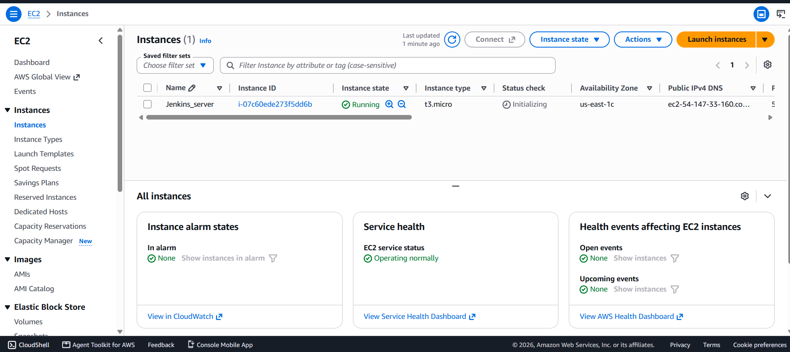
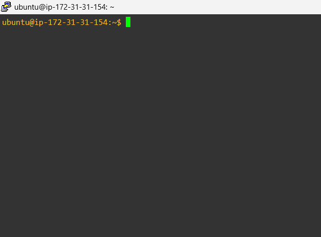
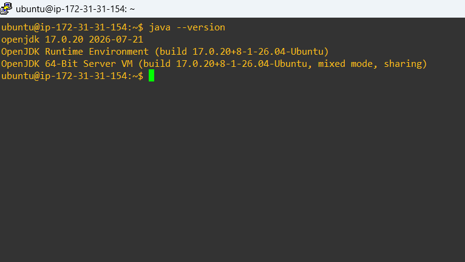
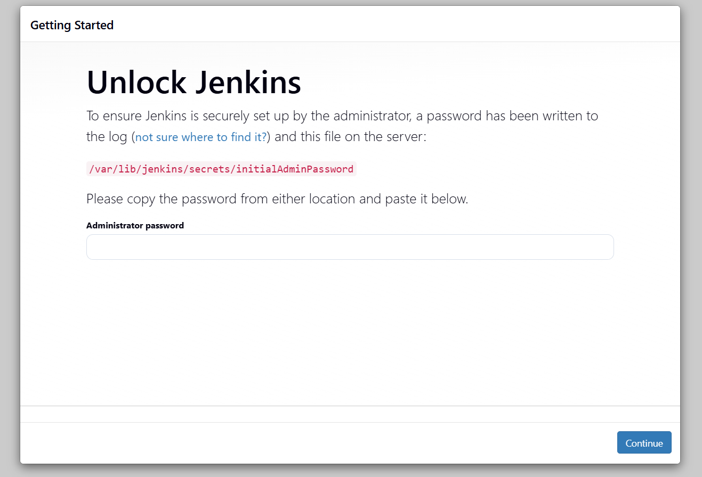
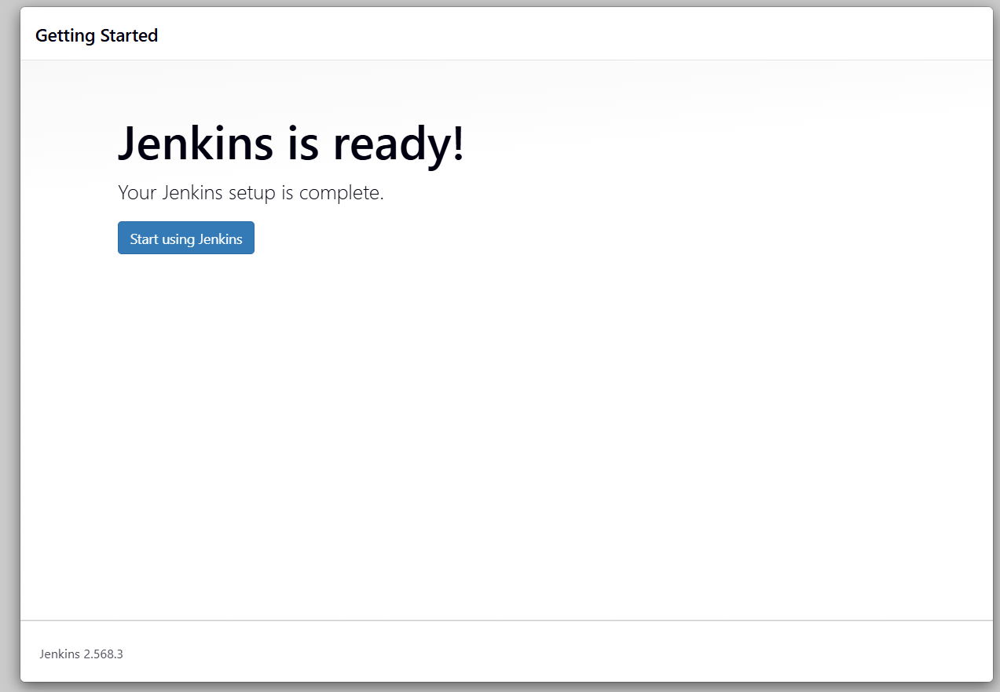
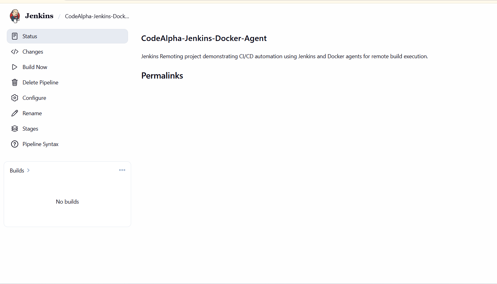
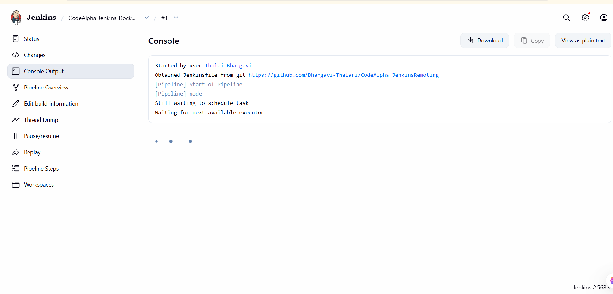
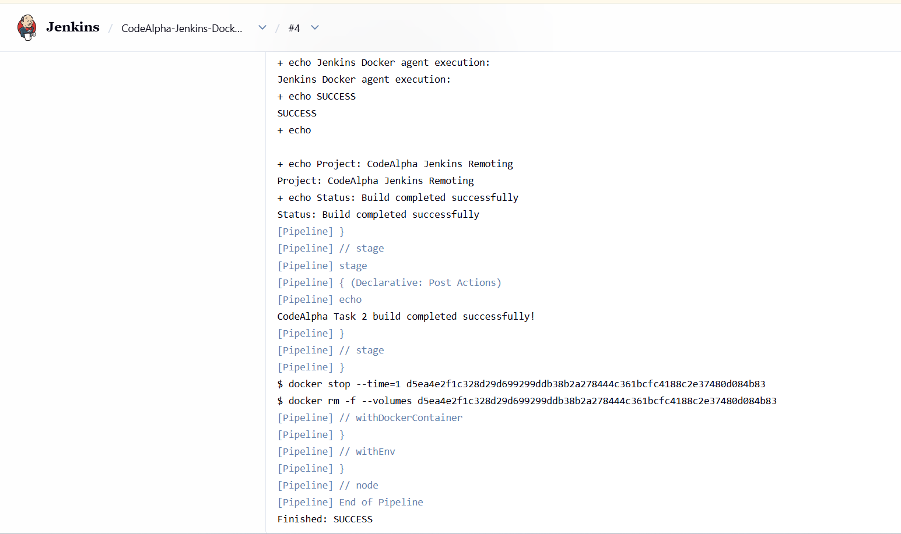

# CodeAlpha_JenkinsRemoting
Jenkins Remoting project demonstrating CI/CD automation using Jenkins and Docker agents for remote build execution.

# Jenkins Remoting with Docker Agent

A hands-on DevOps project demonstrating Continuous Integration (CI) using Jenkins, Docker, AWS EC2, and GitHub.

---

## AWS EC2 Setup

First, I created an AWS EC2 instance using the Ubuntu operating system. This EC2 instance was used to host the Jenkins server.

The required instance configuration and security group settings were configured to allow access to the server.



## Connecting to EC2

After creating the EC2 instance, I connected to the Ubuntu server using SSH through the terminal.

This allowed me to access the EC2 instance and perform the required Jenkins and Docker setup.



## Java Prerequisite

Before installing Jenkins, Java 17 was installed as a prerequisite for running Jenkins.

The Java installation was verified using the `java -version` command.

```bash
sudo apt update
sudo apt install openjdk-17-jre -y
java -version
```



## Jenkins Installation

After installing and verifying Java 17, Jenkins was installed on the Ubuntu EC2 instance.

The Jenkins service was started and enabled to run automatically.

Jenkins was then accessed through port `8080` using the public IP address of the EC2 instance.



## Jenkins Ready

After the installation was completed, Jenkins was successfully started and accessed through the web browser.

The Jenkins dashboard was available, confirming that the Jenkins server was running successfully on the AWS EC2 instance.



## 🐳 Docker Installation

After setting up Jenkins, Docker was installed on the Ubuntu EC2 instance to provide the container environment required for the Jenkins pipeline.

Docker was installed and verified using the following commands:

```bash
sudo apt update
sudo apt install docker.io -y
sudo systemctl start docker
sudo systemctl enable docker
sudo systemctl status docker
docker --version
```

Docker was successfully installed and configured on the EC2 instance for use with Jenkins.

## 🔌 Docker Pipeline Plugin

After installing Docker on the EC2 instance, the **Docker Pipeline** plugin was installed in Jenkins.

This plugin allows Jenkins Pipeline jobs to use Docker containers as build environments and execute pipeline stages inside Docker agents.

The plugin was installed from:

**Jenkins Dashboard → Manage Jenkins → Plugins → Available Plugins → Docker Pipeline → Install**

After installation, Jenkins was ready to use Docker as the execution environment for the pipeline.

## Jenkins Pipeline Execution

After installing Docker and the Docker Pipeline plugin, the Jenkins pipeline was configured using the `Jenkinsfile` from the GitHub repository.

The pipeline was triggered from Jenkins, and the defined stages were executed automatically.

The pipeline uses Docker as the execution environment for running the build stages.



## Docker Agent Execution

The Jenkins pipeline was executed inside the configured Docker environment.

The pipeline used the `ubuntu:22.04` Docker image as the Jenkins agent. The execution environment was verified by checking the hostname, current user, operating system, and workspace.

This demonstrates how Jenkins can use a Docker container as an isolated execution environment for CI tasks.



## Build Verification

After the pipeline execution was completed, the build was successfully verified.

The Jenkins console output confirmed that the Docker-based pipeline executed successfully and all configured stages completed without errors.

This confirms that Jenkins was able to execute the CI pipeline using the configured Docker agent.


